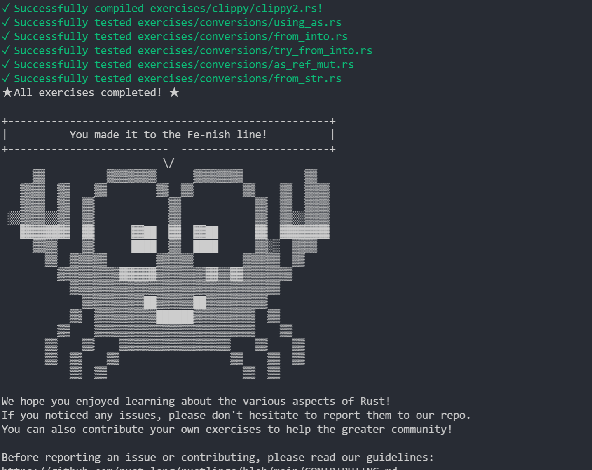

# Daily Schedule

## Day 1 2021/7/1

之前虽然学过一次rust但是掌握太粗糙，故这几天重新过一遍，加强对所有权等比较重要概念的理解，

这周还在考试故进度稍微落后

之前的环境是在ubuntu 20.04上面的，今天在windows下将rust工具链重新配置了一次，也解决了debug的问题。

## Day 2 2021/7/2

今天把调试和宏展开之类的环境配了一下，简单的rust语法基本扫盲完毕，之前没学会的宏也有了初步掌握，一些语法特性和语法糖可以比较好的理解了，因为要有练习题刚刚好力扣上面有rust的评测，就随便写了道两数之和）

准备先去把lab环境搭建一下看看具体是要完成什么样的任务。

## Day 3 2021/7/3

今天配合了lab的环境，并基本读懂了lab 1中的内容，成功在控制台输出了彩色字符串，明天预计可以完成lab 1，而且还需要回头看看risc-v的一些相关知识。
rust学习方面用rust写了写二叉树，还是比想象中要困难的，而且用到了一些特性去回避所有权问题。

## Day 4 2021/7/4

这两天在做离校准备，收行李加赶飞机），进度会比较慢，今天回头复习了lab 1的内容并且大概浏览了一下lab 2的内容，学会使用了gdb调试，对异常/中断委托理解上尚有问题，需要再研究一下。

## Day 5 2021/7/5

回家，暂无进度

## Day 6 ~ Day 7 2021/7/6 ~ 20201/7/7

这两天把rustlings写了2/3，并且回头看了rust编程之道的一些概念加深了理解，预计明天完成rustlings的所有内容和lab 1。

## Day 8 ~ Day 9 2021/7/8 ~ 20201/7/9

完成了rustlings，对一些比较陌生的概念也理清楚了，这两天有别的安排所以进度稍微慢了点

## Day 10 2021/7/10

今天进度不错，完成了lab-1并且写了总结，对中断处理和rust编写操作系统有了个更感性的认识，晚上把lab-2的实验指导看完了，实验要求也大致明白了，预计明天可以上手实现线段树。

## Day 11 20201/7/11

今天调试了一早上的lab-2，发现自己昨天的理解还是存在偏差，还经常把堆上的内存分配和物理页分配弄混淆，不过调试了以后收获还是蛮大的，一些以前就了解到的内存分配机制在测试中也明显看出来，比如切片扩容时每次申请的内存大小会翻倍（有些语言会在超过1024以后执行别的策略，相对比较复杂），还有内存回收调用的时机，也和之前自己单纯的理解稍微有些不一样，收获还是比较大的。

下午翻了翻仓库里面的issue，发现线段树实现后但是每次申请物理内存按目前的内核只能申请一个单位的页表，~~所以这里实现线段树好像有点没必要~~，在issue里面也翻到了这篇论文，先研究研究，如果可行的话打算把申请页表改成支持多个单位的.

晚上扫了一遍后面lab的概览，感觉任务艰巨

## Day 12 2021/7/12

今天是折腾线段树的一天，按着论文的伪代码写结果还感觉到不少论文中可能存在的bug，但是还是理解到不少这个算法中的思想，和朋友讨论了一下暂时没有得出结论，发现在搜索可用内存区间的时候，如果采用lazy的方式，即申请内存的时候不去修改所有线段树中相关的结点，而是用lazy标记最上层对应该区间的结点，确实可以减少在申请/释放内存时的复杂度，可以把多次申请/释放内存合并成一次（虽然最坏的情况下还是lgn），但是后面发现在搜索可分配区间的时候会有问题（策略是每次都搜索可用区间左端点最小的那一个来分配）

如果明天这边还没思路的话先实现一个简单版本去看看后面lab吧，进度有些慢了）

## Day 13 2021/7/13

终于写完线段树了，而且完成的功能相对比较完善了，支持了懒修改，支持了申请/释放一定大小的内存（原本的实验要求只要求单位为一的内存，即一页物理页），等后面实验做完有时间在回头把测试补一下

今晚开始补完lab-2的文档就去康康lab-3了。