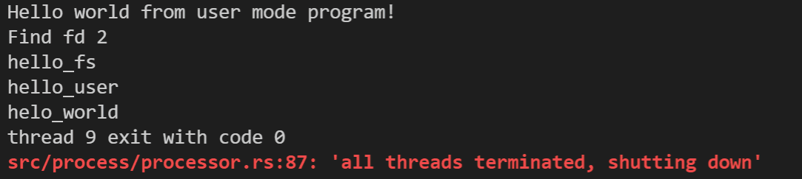

# Lab 6
先看比较重要的系统调用、

在用户程序中的系统调用的流程是：
```rust
unsafe {
        llvm_asm!("ecall"
            : "={x10}" (ret)
            : "{x10}" (arg0), "{x11}" (arg1), "{x12}" (arg2), "{x17}" (id)
            : "memory"      
            : "volatile");
}
```
将参数放入相应的寄存器中，并且触发ecall，这在操作系统只会表现为
```rust
Trap::Exception(Exception::UserEnvCall) => syscall_handler(context)
```
触发了UserEnvCall中断，所以操作系统可以通过存放在x17中的id的值来判断系统调用类型，传入的参数arg0 arg1 arg2放在x10 x11 x12，这些都可以自由实现，返回值ret也会放在x10寄存器中，操作系统可以通过改变x10的值来向用户程序返回值，然后继续执行该用户程序的context。

## 实现sys_open()

这个实验还是相对比较简单的，系统调用的时候传入文件的名字，在系统处理中断的时候读取文件并挂载到进程的文件描述符中，并且返回fd，用户程序就可以通过fd来读取文件中的信息。

几个细节
1. 把文件挂载打包成磁盘镜像，在user目录下面新加了test_files文件夹，里面放入了想测试的文件，然后在Makefile中加入下面几行就完成了
    ```makefile
    # 测试文件
    TEST_FILES  := test_files/*
    # 在build命令下面加一行
    @cp $(TEST_FILES) $(OUT_DIR)
    ```
2. 解析传入参数中的字符串

由于字符串是大小不定的，放入寄存器是放不下的，故传参的时候只能传入它的指针，因为要usize类型，故要进行类型转换，用户程序中的接口如下，同时还要传入字符串的程度以便操作系统解析。
```rust
pub fn sys_open(name: &str) -> isize {
    syscall(SYSCALL_OPEN, name.as_ptr() as usize, name.len(), 0)
}
```
这里先把&str转成*const u8类型的指针再转成usize

在os中的解析
```rust
    let buffer = unsafe { from_raw_parts(name as *const u8, len) };
    let mut name = String::new();
    for &c in buffer.iter() {
        name.push(c as char);
    }
    let f = ROOT_INODE.find(name.as_str()).unwrap();
    let processor = PROCESSOR.lock().current_thread().process.clone();
    let ret = processor.inner().descriptors.len();
    processor.inner().descriptors.push(f);
}
```
先用from_raw_parts转成u8数组，再遍历写入字符串，完成转换。
然后就是找到文件，写入porcessor的文件描述中，并不复杂。

用户程序调用
```rust
pub fn main() -> usize {
    println!("Hello world from user mode program!");
    let fd = sys_open("hello_fs") as usize;
    let mut buffer = [0u8; 64];
    let size = sys_read(fd, &mut buffer);
    let s = String::from_utf8(buffer.iter().copied().take(size as usize).collect()).unwrap();
    println!("Find fd {}", fd);
    println!("{}", s);
    0
}
```
结果如下：



